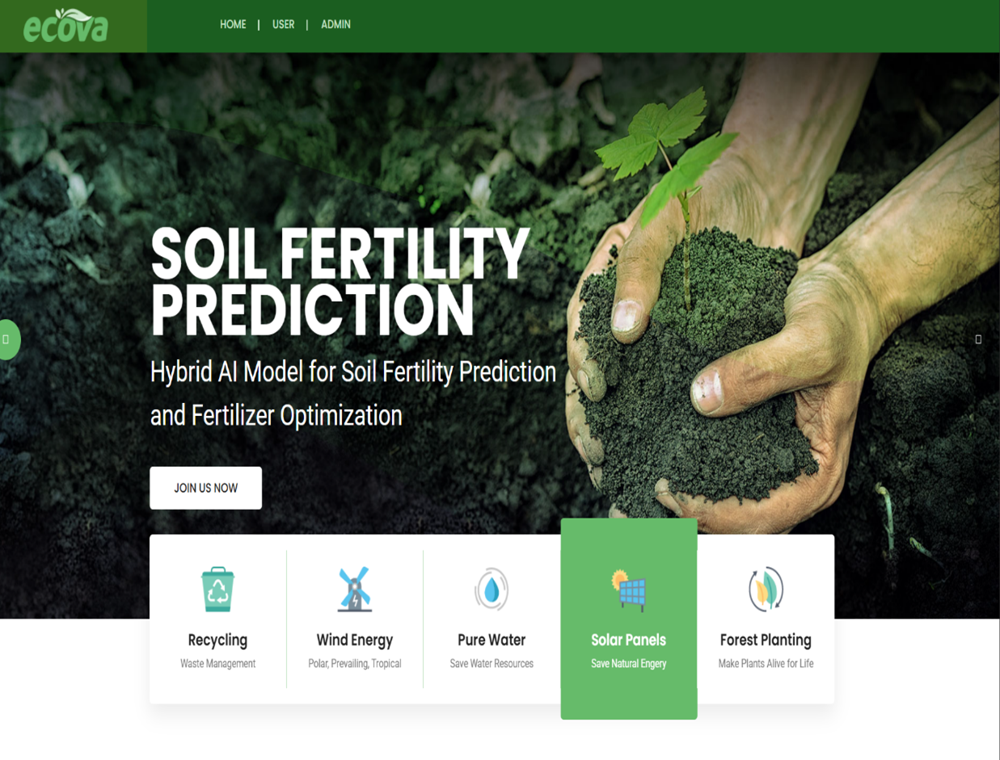

# 🌱 Soil Fertility & Crop Recommendation System

A professional agriculture-based web application that helps users analyze soil fertility and get crop/fertilizer recommendations using manual soil input. The project is also designed for future AI-based leaf image nutrient deficiency analysis.

---

## 📌 Project Overview

The current version predicts soil fertility and crop recommendations using manual input-based analysis.  
The long-term goal is to extend the system with **leaf image analysis** so that farmers can upload leaf images and detect possible nutrient deficiencies.

---

## 🎯 Problem Statement

Farmers often face difficulty identifying:

- Soil fertility condition
- Suitable crop selection
- Nutrient deficiency symptoms
- Fertilizer recommendation

This project provides a web-based solution to simplify decision-making using data-driven analysis.

---

## ✅ Current Features

- Manual soil parameter input
- Soil fertility prediction
- Crop recommendation
- Fertilizer information support
- User login/register module
- Admin module
- Flask backend
- MySQL database integration
- Dataset-based recommendation flow

---

## 🧠 Future Enhancement: Leaf Image Nutrient Analysis

The main future concept of this project is to add **AI-based leaf image analysis**.

In the future version, farmers will be able to upload a leaf image, and the system will analyze it to detect nutrient deficiencies such as:

- Nitrogen deficiency
- Phosphorus deficiency
- Potassium deficiency

Planned AI models:

- CNN
- EfficientNet
- U-Net segmentation
- OpenCV image preprocessing

> **Note:** The current version supports manual soil input-based prediction. Leaf image-based nutrient deficiency detection is planned as an advanced future enhancement.

---

## 🛠️ Tech Stack

### Frontend
- HTML
- CSS
- Bootstrap
- JavaScript

### Backend
- Python
- Flask

### Database
- MySQL

### Machine Learning / Data Analysis
- Pandas
- NumPy
- Scikit-learn
- LightGBM
- Matplotlib
- Seaborn
- Plotly

---

## 📂 Project Structure

```text
soil-fertility-crop-recommendation-system/
│
├── static/
│   ├── css/
│   ├── js/
│   └── images/
│
├── templates/
│   ├── index.html
│   ├── login.html
│   ├── prediction.html
│   └── result.html
│
├── dataset/
│   └── soil_data.csv
│
├── database/
│   └── database.sql
│
├── docs/
│   ├── screenshots/
│   │   ├── home-page.png
│   │   ├── login-page.png
│   │   ├── prediction-page.png
│   │   └── result-page.png
│   │
│   ├── demo/
│   │   └── project-demo.gif
│   │
│   ├── architecture-diagram.svg
│   └── SCREENSHOT_AND_DEMO_GUIDE.md
│
├── main.py
├── requirements.txt
├── README.md
└── .gitignore
```

> Extra template/assets required by the current Flask routes are preserved to keep the project runnable.

---

## 📸 Project Screenshots

### Home Page


### Login Page


### Prediction Page


### Result Page


---

## 🎬 Project Demo



---

## 🏗️ Architecture Diagram


## ⚙️ Installation and Setup

### 1. Clone the repository

```bash
git clone https://github.com/Thiyagu3812/soil-fertility-crop-recommendation-system.git
```

### 2. Navigate to the project folder

```bash
cd soil-fertility-crop-recommendation-system
```

### 3. Install dependencies

```bash
pip install -r requirements.txt
```

### 4. Configure MySQL database

Create a database named:

```sql
crop
```

Then import:

```text
database/database.sql
```

### 5. Run the application

```bash
python main.py
```

Open in browser:

```text
http://127.0.0.1:5000/
```

---

## 🚀 GitHub Push Commands

```bash
git init
git add .
git commit -m "initial commit: soil fertility crop recommendation system"
git branch -M main
git remote add origin https://github.com/Thiyagu3812/soil-fertility-crop-recommendation-system.git
git push -u origin main
```

---

## 💼 Resume Value

This project demonstrates:

- Full-stack web development
- Python Flask backend development
- MySQL database integration
- Machine learning-based recommendation flow
- Agriculture domain problem solving
- Future-ready AI project planning
- Professional GitHub documentation

---

## 🔮 Future Scope

- Leaf image nutrient deficiency detection
- Soil + leaf combined fertility prediction
- Fertilizer dosage recommendation
- Farmer-friendly mobile UI
- Cloud deployment
- Multilingual support
- AI chatbot for farming guidance

---

## 👨‍💻 Developer

**Thiyagu**  
Aspiring Java Backend & AI Developer

GitHub: https://github.com/Thiyagu3812

---

## ⭐ Final Note

This project is built as a foundation for an intelligent agriculture assistance system. The future vision is to combine manual soil analysis with AI-powered leaf image analysis to help farmers make better crop and fertilizer decisions.
